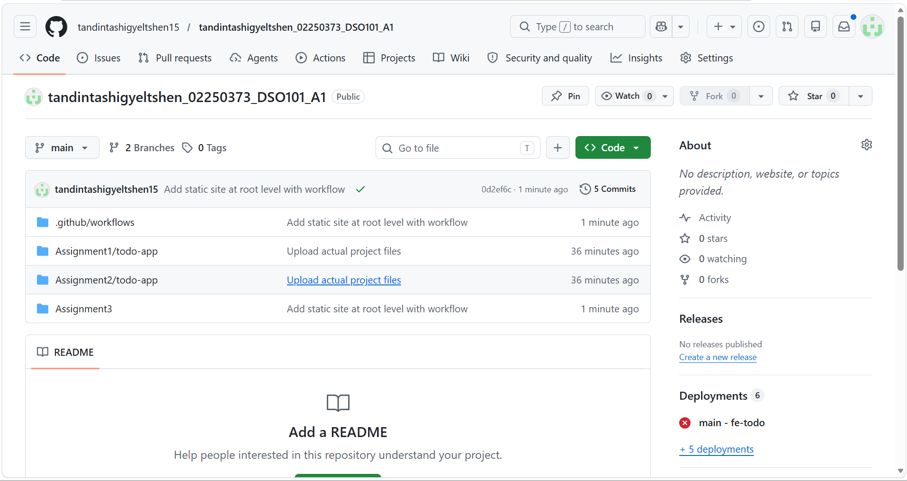
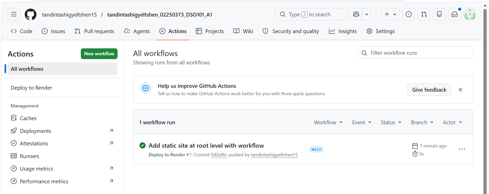
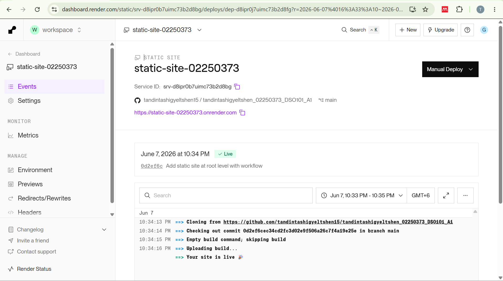
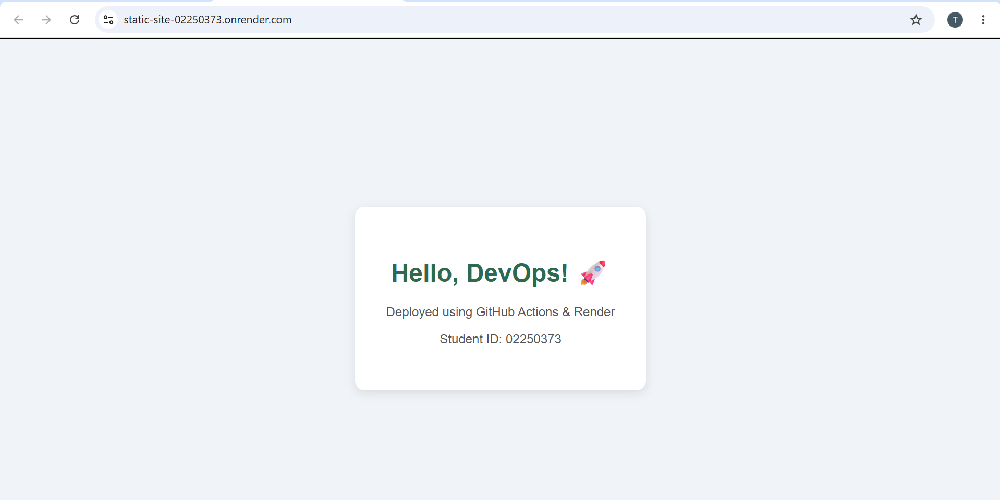
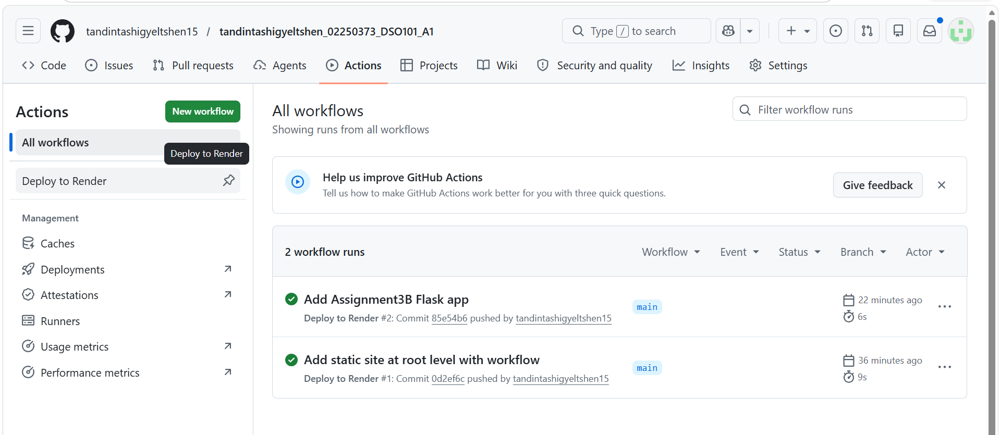
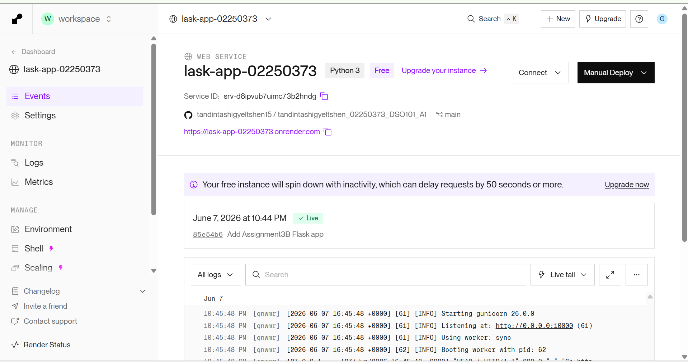
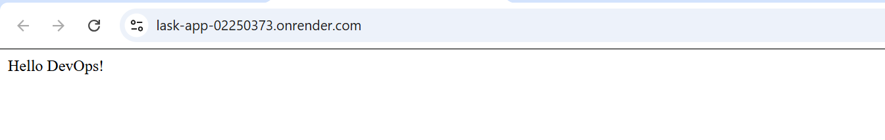

# Assignment IV — Continuous Integration and Continuous Deployment (DSO101)

**Name:** Tandin Tashi Gyeltshen  
**Student ID:** 02250373  
**Programme:** Bachelor of Engineering in Software Engineering (SWE)  
**Date of Submission:** 13th May  

---

## Table of Contents
1. [Objective](#objective)
2. [Tools Used](#tools-used)
3. [Option A — Static Website](#option-a--static-website)
4. [Option B — Flask Web Application](#option-b--flask-web-application)
5. [CI/CD Workflow](#cicd-workflow)
6. [Conclusion](#conclusion)

---

## Objective

The objective of this assignment is to learn the basics of Git & GitHub, CI/CD using GitHub Actions, and deployment using Render. This was achieved by creating a simple web application, pushing the code to GitHub, setting up automatic deployment using GitHub Actions, and deploying the app on Render.

---

## Tools Used

| Tool | Purpose |
|------|---------|
| GitHub | Version control and code hosting |
| GitHub Actions | CI/CD pipeline automation |
| Render | Cloud deployment platform |
| Python Flask | Web framework for Option B |
| VS Code | Code editor |
| Git | Local version control |

---

## Option A — Static Website

### Description
A static website built using HTML and CSS, deployed on Render as a Static Site.

### GitHub Repository
**Repo URL:** https://github.com/tandintashigyeltshen15/tandintashigyeltshen_02250373_DSO101_A1

### Live Deployed URL
**Live URL:** https://static-site-02250373.onrender.com

### Files Created

**`Assignment3/index.html`**
```html
<!DOCTYPE html>
<html lang="en">
<head>
  <meta charset="UTF-8" />
  <meta name="viewport" content="width=device-width, initial-scale=1.0"/>
  <title>My First Deployment</title>
  <link rel="stylesheet" href="style.css" />
</head>
<body>
  <div class="container">
    <h1>Hello, DevOps! 🚀</h1>
    <p>Deployed using GitHub Actions & Render</p>
    <p>Student ID: 02250373</p>
  </div>
</body>
</html>
```

**`Assignment3/style.css`**
```css
body {
  font-family: Arial, sans-serif;
  background-color: #f0f4f8;
  display: flex;
  justify-content: center;
  align-items: center;
  height: 100vh;
  margin: 0;
}
.container {
  background: white;
  padding: 40px;
  border-radius: 12px;
  box-shadow: 0 4px 12px rgba(0,0,0,0.1);
  text-align: center;
}
h1 { color: #2d6a4f; }
p  { color: #555; }
```

### Steps Taken
1. Created `index.html` and `style.css` inside the `Assignment3` folder in VS Code
2. Created `.github/workflows/deploy.yml` at the root level of the repository
3. Committed and pushed all files to GitHub using Git
4. GitHub Actions workflow triggered automatically on push to `main`
5. Connected the GitHub repository to Render
6. Created a new **Static Site** on Render with root directory set to `Assignment3`
7. Render deployed the site automatically

### Screenshot — GitHub Repository (Code Tab)
> 

### Screenshot — GitHub Actions (Green Checkmark)
> 

### Screenshot — Render Dashboard (Live)
> 

### Screenshot — Live Website in Browser
> 

---

## Option B — Flask Web Application

### Description
A Python Flask web application returning "Hello DevOps!" deployed on Render as a Web Service.

### GitHub Repository
**Repo URL:** https://github.com/tandintashigyeltshen15/tandintashigyeltshen_02250373_DSO101_A1

### Live Deployed URL
**Live URL:** https://lask-app-02250373.onrender.com

### Files Created

**`Assignment3B/app.py`**
```python
from flask import Flask
app = Flask(__name__)

@app.route('/')
def home():
    return "Hello DevOps!"

if __name__ == '__main__':
    app.run()
```

**`Assignment3B/requirements.txt`**
```
flask
gunicorn
```

### Steps Taken
1. Created `app.py` and `requirements.txt` inside the `Assignment3B` folder in VS Code
2. The existing `.github/workflows/deploy.yml` at root level was already in place
3. Committed and pushed all files to GitHub
4. GitHub Actions workflow triggered automatically on push to `main`
5. Connected the GitHub repository to Render
6. Created a new **Web Service** on Render with the following settings:
   - Runtime: Python 3
   - Root Directory: `Assignment3B`
   - Build Command: `pip install -r requirements.txt`
   - Start Command: `gunicorn app:app`
7. Render built and deployed the Flask app successfully

### Screenshot — GitHub Actions (Triggered by Flask Push)
> 

### Screenshot — Render Web Service Dashboard (Live)
> 

### Screenshot — Live Flask App in Browser
> 

---

## CI/CD Workflow

The same GitHub Actions workflow file was used for both options. It is located at `.github/workflows/deploy.yml` at the root of the repository.

```yaml
name: Deploy to Render

on:
  push:
    branches: [ "main" ]

jobs:
  deploy:
    runs-on: ubuntu-latest

    steps:
    - name: Checkout code
      uses: actions/checkout@v3

    - name: Dummy step
      run: echo "Code pushed successfully!"
```

### How it works
- Every time code is pushed to the `main` branch, GitHub Actions automatically triggers the workflow
- The workflow checks out the code and confirms the push was successful
- Render is connected to the repository and automatically redeploys whenever changes are pushed to `main`
- This creates a full CI/CD pipeline: **Push code → GitHub Actions runs → Render deploys**

---

## Conclusion

This assignment demonstrated the basics of CI/CD by deploying two web applications using GitHub, GitHub Actions, and Render. Both a static HTML site and a Python Flask app were successfully deployed and are accessible via live URLs. The GitHub Actions workflow automatically triggers on every push to the `main` branch, ensuring continuous deployment with minimal manual effort.

| | Option A | Option B |
|--|---------|---------|
| Type | Static Site | Web Service |
| Language | HTML/CSS | Python Flask |
| Render Type | Static Site | Web Service |
| Live URL | https://static-site-02250373.onrender.com | https://lask-app-02250373.onrender.com |
| Status | ✅ Live | ✅ Live |