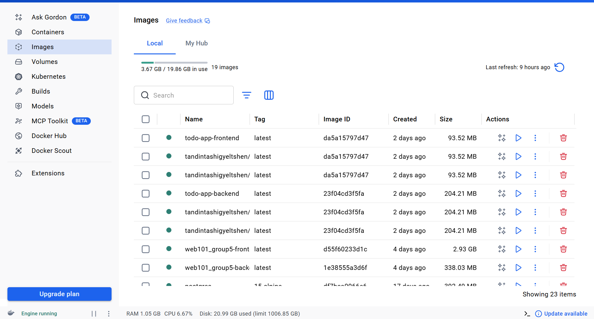
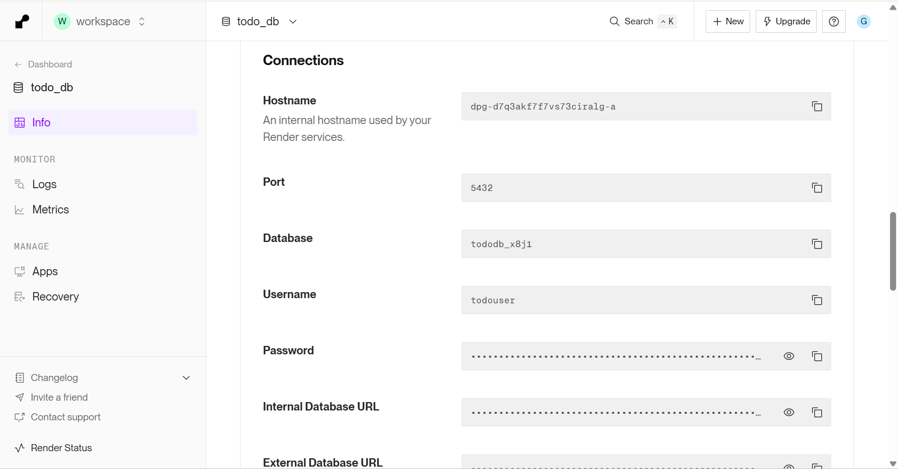
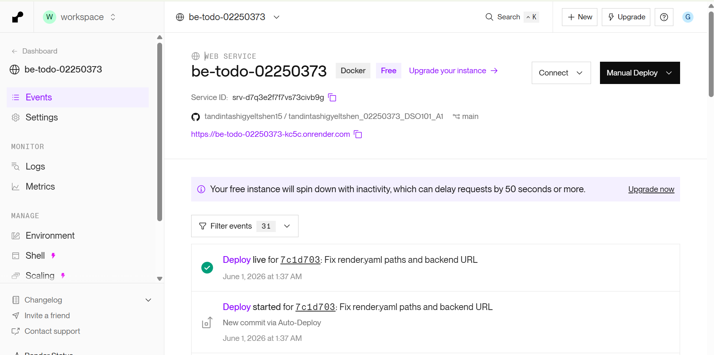
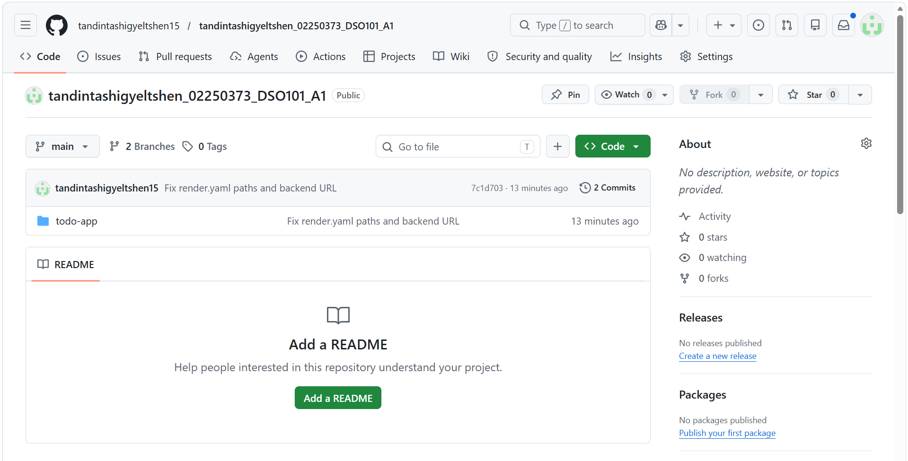
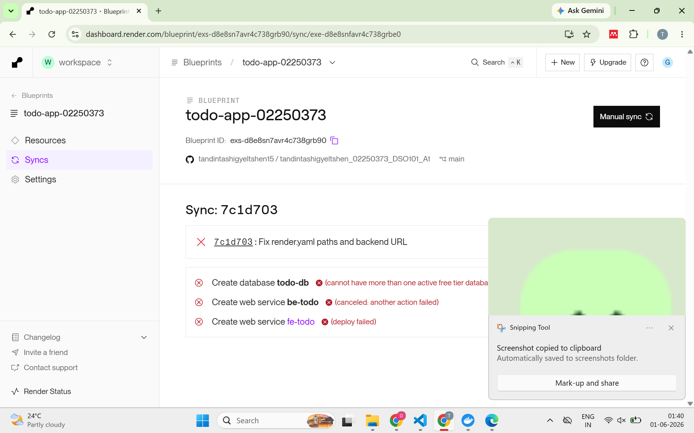
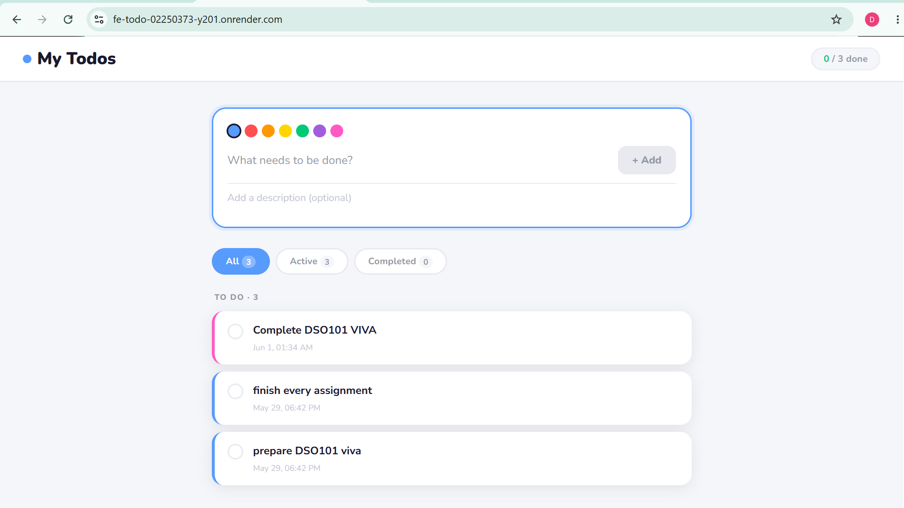

# TodoApp — DSO101 Assignment 1

A full-stack Todo application built with **React**, **Node/Express**, and **PostgreSQL**, deployed via Docker on Render.com.

---

## Project Structure

```
todo-app/
├── frontend/
│   ├── src/
│   │   ├── App.js          # Main React component (CRUD UI)
│   │   ├── App.css         # Styles
│   │   └── index.js        # Entry point
│   ├── public/
│   │   └── index.html
│   ├── Dockerfile          # Multi-stage: build → nginx
│   ├── nginx.conf          # SPA routing config
│   └── .env.example
├── backend/
│   ├── server.js           # Express API (CRUD endpoints)
│   ├── Dockerfile
│   └── .env.example
├── render.yaml             # Render Blueprint (Part B)
├── docker-compose.yml      # Local dev environment
└── .gitignore
```

---

## Step 0 — Run Locally

### Prerequisites
- Node.js 18+
- Docker & Docker Compose

### Option A: Docker Compose (recommended)

```bash
# Clone the repo
git clone https://github.com/tandintashigyeltshen15/tandintashigyeltshen_02250373_DSO101_A1.git
cd studentname_studentnumber_DSO101_A1

# Copy env files (edit with your values if needed)
cp backend/.env.example backend/.env
cp frontend/.env.example frontend/.env

# Start all services (db, backend, frontend)
docker compose up --build
```

- Frontend: http://localhost:3000  
- Backend API: http://localhost:5000  
- Health check: http://localhost:5000/health

### Option B: Manual (without Docker)

**Database** — Start a local PostgreSQL instance and create a database called `tododb`.

**Backend:**
```bash
cd backend
cp .env.example .env   # Edit DB_* values to match your local Postgres
npm install
npm start
```

**Frontend:**
```bash
cd frontend
cp .env.example .env   # REACT_APP_API_URL=http://localhost:5000
npm install
npm start
```

---

## Part A — Deploy Pre-built Docker Image to Docker Hub

### 1. Build and tag images (use your student ID as tag)

```bash
# Backend
docker build -t YOUR_DOCKERHUB_USERNAME/be-todo:YOUR_STUDENT_ID ./backend

# Frontend
docker build -t YOUR_DOCKERHUB_USERNAME/fe-todo:YOUR_STUDENT_ID ./frontend
```

### 2. Push to Docker Hub

```bash
docker login

docker push YOUR_DOCKERHUB_USERNAME/be-todo:YOUR_STUDENT_ID
docker push YOUR_DOCKERHUB_USERNAME/fe-todo:YOUR_STUDENT_ID
```

> 

### 3. Create PostgreSQL on Render

1. Go to [render.com](https://render.com) → **New → PostgreSQL**
2. Name it `todo-db`, choose the **Free** plan
3. Copy the **Internal Database URL** details (host, user, password, db name)

> 

### 4. Deploy Backend on Render

1. **New → Web Service → Deploy an existing image from a registry**
2. Image URL: `docker.io/YOUR_DOCKERHUB_USERNAME/be-todo:YOUR_STUDENT_ID`
3. Add environment variables:

| Key | Value |
|-----|-------|
| `DB_HOST` | (from Render PostgreSQL dashboard) |
| `DB_USER` | (from Render PostgreSQL dashboard) |
| `DB_PASSWORD` | (from Render PostgreSQL dashboard) |
| `DB_NAME` | (from Render PostgreSQL dashboard) |
| `DB_PORT` | `5432` |
| `DB_SSL` | `true` |
| `PORT` | `5000` |

4. Click **Deploy**

> 

### 5. Deploy Frontend on Render

1. **New → Web Service → Deploy an existing image from a registry**
2. Image URL: `docker.io/YOUR_DOCKERHUB_USERNAME/fe-todo:YOUR_STUDENT_ID`
3. Add environment variables:

| Key | Value |
|-----|-------|
| `REACT_APP_API_URL` | `https://be-todo.onrender.com` (your backend URL) |

4. Click **Deploy**

> 

---

## Part B — Automated Build and Deployment from Git

This uses the `render.yaml` Blueprint so every `git push` triggers a new build and deploy automatically.

### 1. Push your repo to GitHub

```bash
git init
git add .
git commit -m "Initial commit — DSO101 A1"
git remote add origin https://github.com/tandintashigyeltshen15/tandintashigyeltshen_02250373_DSO101_A1.git
git push -u origin main
```

> 

### 2. Connect repo to Render via Blueprint

1. Go to Render → **New → Blueprint**
2. Connect your GitHub account and select your repository
3. Render detects `render.yaml` automatically
4. Review the services (be-todo, fe-todo, todo-db) and click **Apply**

>  

### 3. Update the frontend API URL

After the backend deploys, copy its URL (e.g. `https://be-todo.onrender.com`) and update `render.yaml`:

```yaml
- key: REACT_APP_API_URL
  value: https://be-todo.onrender.com   # ← replace with actual URL
```

Then push:
```bash
git add render.yaml
git commit -m "Update backend URL in render.yaml"
git push
```

Render will automatically rebuild and redeploy.

### 4. Verify

- Visit the frontend URL — you should see the Todo app
- Add, edit, complete, and delete tasks
- Check the backend health: `https://be-todo.onrender.com/health`

> 

---

## API Reference

| Method | Endpoint | Description |
|--------|----------|-------------|
| `GET` | `/health` | Health check |
| `GET` | `/api/todos` | Get all todos |
| `GET` | `/api/todos/:id` | Get single todo |
| `POST` | `/api/todos` | Create todo |
| `PUT` | `/api/todos/:id` | Update todo |
| `DELETE` | `/api/todos/:id` | Delete todo |

**POST/PUT body:**
```json
{
  "title": "Buy groceries",
  "description": "Milk, eggs, bread",
  "completed": false
}
```

---

## Environment Variables

### Backend (`.env`)
```
PORT=5000
DB_HOST=localhost
DB_USER=postgres
DB_PASSWORD=yourpassword
DB_NAME=tododb
DB_PORT=5432
DB_SSL=false
```

### Frontend (`.env`)
```
REACT_APP_API_URL=http://localhost:5000
```

> ⚠️ Never commit `.env` files. They are in `.gitignore`.
