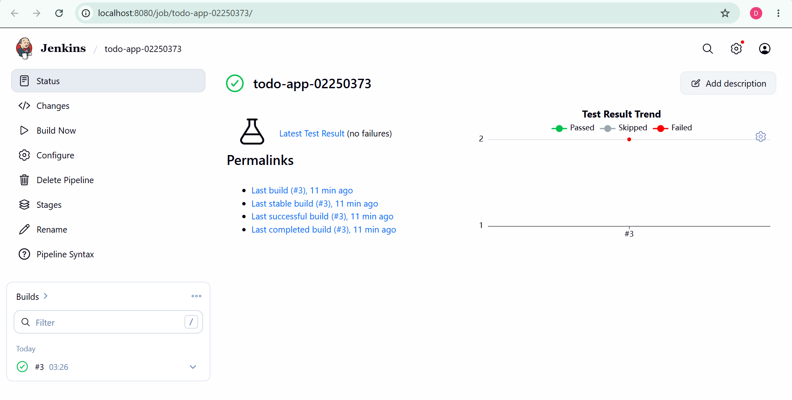
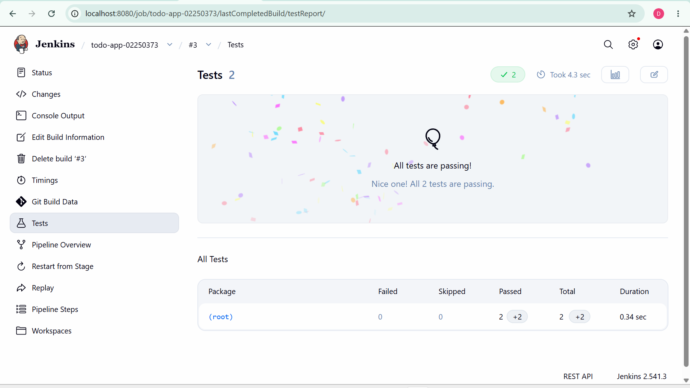
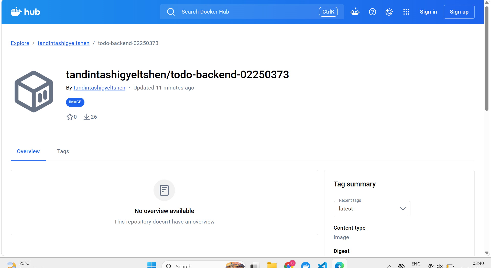

# TodoApp — DSO101 Assignment 2

CI/CD pipeline using Jenkins to automate build, test, and deployment of the todo app from Assignment 1.

---

## GitHub Repository
https://github.com/tandintashigyeltshen15/tandintashigyeltshen_02250373_DSO101_A2

## Docker Hub Image
https://hub.docker.com/r/tandintashigyeltshen/todo-backend-02250373

---

## Tools & Technologies
- Jenkins (localhost:8080)
- GitHub
- Node.js & npm
- Jest + jest-junit (unit testing)
- Docker

---

## Pipeline Stages
1. **Checkout** — Clone repo from GitHub
2. **Install** — Run `npm install` in backend
3. **Test** — Run Jest unit tests, publish JUnit results
4. **Build Docker Image** — Build backend Docker image
5. **Push to Docker Hub** — Push image to Docker Hub registry

---

## How to Configure the Pipeline

### 1. Install Jenkins
- Download from jenkins.io
- Run on localhost:8080
- Install plugins: NodeJS, Pipeline, GitHub Integration, Docker Pipeline, Credentials

### 2. Configure Node.js
- Manage Jenkins → Tools → NodeJS
- Add NodeJS 20.x, name it `NodeJS`

### 3. Add Credentials
- GitHub PAT → ID: `github-creds`
- Docker Hub → ID: `docker-hub-creds`

### 4. Create Pipeline Job
- New Item → Pipeline → `todo-app-02250373`
- Pipeline from SCM → Git
- Repo URL: https://github.com/tandintashigyeltshen15/tandintashigyeltshen_02250373_DSO101_A2.git
- Script Path: `Jenkinsfile`

### 5. Run
- Click Build Now
- Pipeline runs all 5 stages automatically

---

## Unit Tests
Tests are in `backend/server.test.js` using Jest and Supertest.

```javascript
describe('Todo API', () => {
  test('GET /health returns ok')
  test('GET /api/todos returns array')
})
```

Run locally:
```bash
cd backend
npm test
```

---

## Screenshots

### Successful Pipeline Execution


### Test Results


### Docker Hub Image


---

## Challenges Faced
- Jenkins plugins failed to load due to missing Credentials plugin — fixed by manually downloading credentials.hpi
- Jenkins running on Windows required using `bat` instead of `sh` in Jenkinsfile
- Pipeline Stage Tags Metadata plugin had network timeout — fixed by manual download

---

## Jenkinsfile
See [Jenkinsfile](Jenkinsfile) in the repo root.